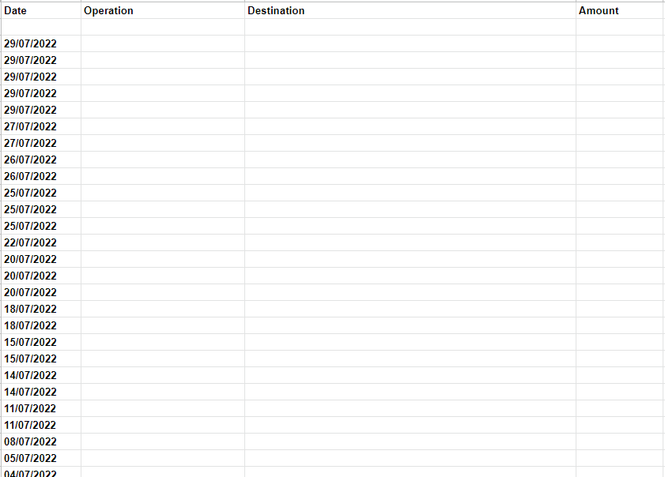

# Finances control

<p align="center">
    
</p>

This application was developed to fulfill my financial needs, so that i can organize them in spreadsheets, dashboards and make graphics. It uses a FTP server to store and read the bank statement file.
The application will read a given bank statement and will write it in a google sheet.

---

## Requirements

- Python
- Gspread
- Pandas

---

## How to install

1. Download the repository
2. Start a new virtual environment
    - ```python -m venv <name_of_venv>```
    - ```POSIX: source venv/bin/activate```
    - ```WINDOWS: venv/Scripts/activate.bat```
3. Install requirements
    - ```pip install -r requirements.txt```
4. Setup the spreadsheet "Personal finances 2022" in the google sheets
5. Run the script
    - ```python main.py <ftp_address> <ftp_user> <ftp_password>```

**Obs.:** The script only support the 'Inter' brazilian bank

---

## Example



The cell content are hidden*